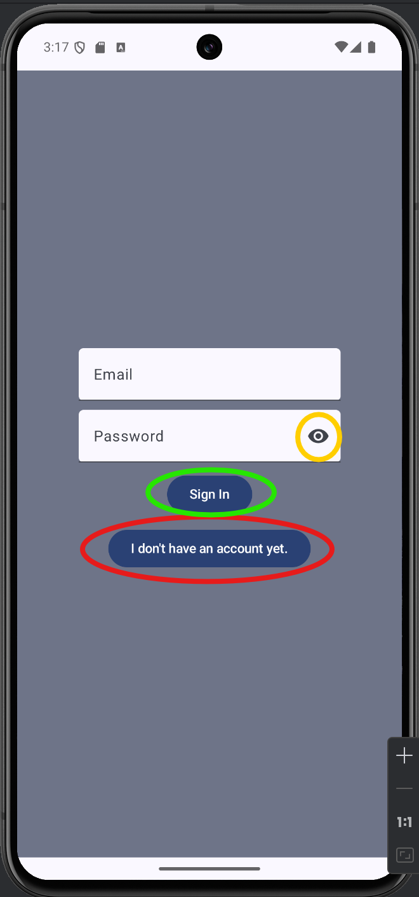
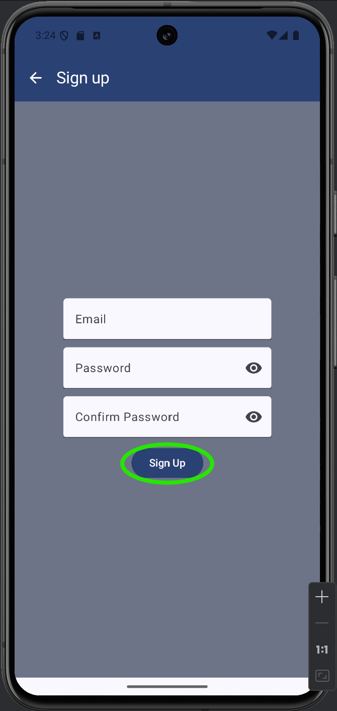
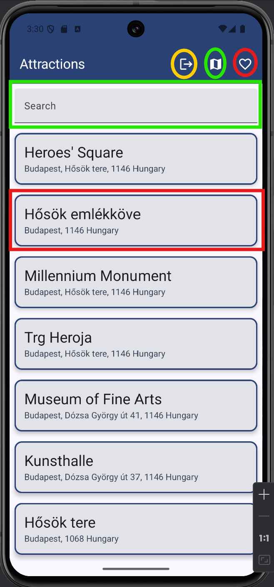
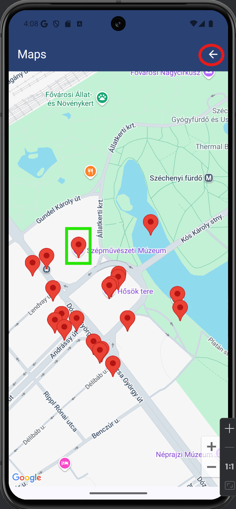
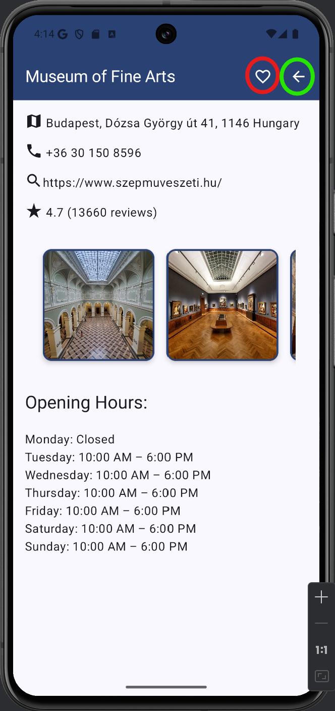
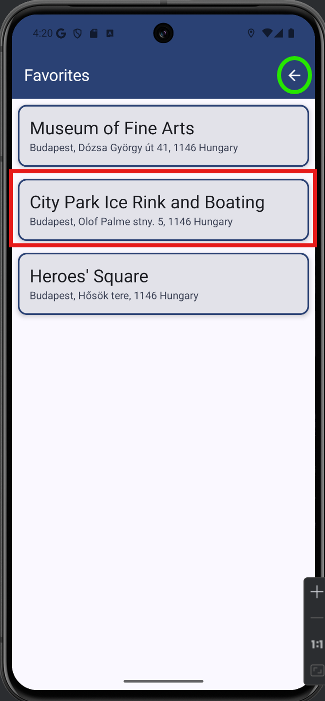

# Házi feladat specifikáció

Információk [itt](https://viauav21.github.io/laborok/hf)

## Androidalapú szoftverfejlesztés
### 2024.11.03. - 2024/25 1. félév
### Vidács Gergely - (VNNQWH)
### vidacsgergo@gmail.com
### Laborvezető: Gazdi László

## Bemutatás

Házi feladatnak egy turisztikai látványosságokat gyűjtő alkalmazást választottam a felsorolt ötletek közül. Az alkalmazás segítségével a felhasználó könnyedén tud pl. egy adott városban vagy akár a tartózkodási helye környezetében látnivalókat keresni és ezekről részletesebb információt szerezni, így könnyebbé és színesebbé téve utazásait.

## Főbb funkciók

Az alkalmazással lehetőség van látnivalókat keresni pl. város szerint vagy egy térkép nézetben a felhasználó lokációja alapján. A látnivalók listában jelennek meg, egy konkrét elemre kattintva további részletek érhetőek el róla, mint például képek, leírás, stb. Lehetőség van menteni is az egyes látványosságokat, ezek később egy külön "kedvencek" képernyőn érhetők el.

Az alkalmazás használatához regisztrációra van szükség, az ott megadott adatokkal lehet belépni.

## Választott technológiák:

Az alkalmazás a kötelezőkön kívül az alábbi technológiákat használja:

- Hálózatkezelés: az alkalmazás a Google Places API-t használja és REST végponton keresztül tölti le a látványosságok adatait.
- Firebase: az alkalmazás Firebase-t használ az adatok tárolásához és szinkronizálásához.
- Pozíciómeghatározás: az alkalmazás pozíciómeghatározást használ a környező látnivalók megjelenítésére.

___

# Házi feladat dokumentáció

### ExploreR

## Bemutatás

Az ExploreR egy turisztikai alkalmazás, lehetőséget biztosít a felhasználóhoz közel levő látványosságok böngészésére. 
A felhasználó térképen is kereshet, mentheti a kiszemelt úticélokat, illetve minden fontosabb információt megtalál a "részletek" képernyőn, ezzel is kényelmesebbé téve utazását. 

## Főbb funkciók

Az alkalmazással lehetőség van látnivalókat keresni pl. város szerint vagy egy térkép nézetben a felhasználó lokációja alapján. A látnivalók listában jelennek meg, egy konkrét elemre kattintva további részletek érhetőek el róla, mint például képek, leírás, stb. Lehetőség van menteni is az egyes látványosságokat, ezek később egy külön "kedvencek" képernyőn érhetők el.

(Az implementáció folyamán úgy döntöttem, hogy a térképhez hasonlóan a keresésre is csak a környező látványosságok között lesz lehetőség.)

Az alkalmazás használatához regisztrációra van szükség, az ott megadott adatokkal lehet belépni.

## Felhasználói kézikönyv

**Bejelentkezés / regisztráció:**

Az alkalmazás használatához szükség van egy felhasználói fiókra, a bejelentkezési képernyőn az alábbi műveletekre van lehetőség:
- **Bejelentkezés:** zölddel jelölt gomb
- **Jelszó mutatása:** sárgával jelölt gomb
- **Regisztráció:** pirossal jelölt gomb

1. ábra: Bejelentkezés képernyő

- Regisztrálni az alábbi képen látható mezők kitöltésével lehet, a zölldel jelölt gombbal kell véglegesíteni a regisztrációt.

2. ábra: Regisztráció képernyő

---
**Látványosságok listája képernyő:**

Ezen a képernyőn a környéken található látványosságok listája található, az alábbi műveletekre van lehetőség:

3. ábra: Látványosságok listája képernyő

- **Kijelentkezés:** sárga körrel jelölt ikon
- **Térkép nézet:** zöld körrel jelölt ikon
- **Kedvencek nézet:** piros körrel jelölt gomb
- **Egy látványosság részleteinek nézete:** például a piros téglalappal jelölt kártyára kattintás
- **Keresés a környező látványosságok között:** zöld téglalappal jelölt keresőmező

---
**Térkép képernyő:**

A térkép képernyőn láthatóak a közelben található látványosságok, a következő műveletekre van lehetőség:

4. ábra: Térkép képernyő

- **Visszalépés a lista nézetre:** piros körrel jelölt ikon
- **Egy látványosság részleteinek megtekintése:** például a zöld téglalappal jelölt pin-re kattintás
- (A térkép zoomolható és görgethető is.)

---
**Részletek képernyő:**

A részletek képernyőn egy adott látványosság fontosabb információi, illetve pár fénykép található, a következő műveletek lehetségesek:

5. ábra: Részletek képernyő

- **Kedvencnek jelölés / kedvenc jelölés visszavonása:** a piros körrel jelölt ikonnal
- **Visszalépés az előző nézetre:** zöld körrel jelölt ikon
- A fényképek oldalra görgethetőek.

---
**Kedvencek képernyő:**

A kedvencek képernyőn a korábban kedvencnek jelölt látványosságok találhatók, a következő műveletekre van lehetőség:

6. ábra: Kedvencek képernyő

- **Visszalépés a lista nézetre:** zöld körrel jelölt ikon
- **Egy kedvenc részleteinek megjelenítése:** a kedvenc kártyájára kattintással (például a pirossal jelölt kártya)

## Felhasznált technológiák:

- Firebase [**realtime database**](https://firebase.google.com/products/realtime-database) a kedvencek tárolására
- [**com.google.android.gms.location package**](https://developers.google.com/android/reference/com/google/android/gms/location/package-summary) a helymeghatározáshoz (térkép nézet)
- Firebase [**authentication**](https://firebase.google.com/products/auth) a felhasználók nyilvántartásához
- [**Google Places SDK for Android (new)**](https://developers.google.com/maps/documentation/places/android-sdk/overview) a látványosságok lekérdezéséhez

## Fontosabb technológiai megoldások
A nulladik problémámba egyből a projekt kezdetén belefutottam már, a függőségek egy darabig sehogy sem akartak együttműködni egymással, így végül gondosan utánaolvasva előlről kellett újra összerakjam a projektet.

A legnehezebb funkció egyértelműen a Places API-hoz kapcsolódott, ugyanis a legtöbb interneten található dokumentáció / segédanyag még nem Compose-t használ.
Úgyhogy a legtöbb időt az vette el, hogy erre rájöjjek, majd arra is, hogy itt nincs szükség a laborokhoz hasonló retrofites megoldásra, ugyanis ez a 
plugin nagyon "okos", miután megértettem a működését már viszonylag egyszerű volt lekérdezéseket generálni.

A térkép használata is sokára sikerült csak, itt is régebbi dokumentációkkal küzdöttem sokat, aztán megtaláltam, hogy van egy szuper és egyszerű Compose könyvtár hozzá.

Ezen kívül a firebase realtime database használatánál akadtak gondjaim, bár faék egyszerű adatszerkezetet mentek bele (egy kulcs és egy ID attribútum), de mégsem akart működni. 
Erre végül az jelentette a megoldást, hogy a getInstance() hívásba meg kellett adni az adatbázis régióját is tartalmazó URL-t.

A DI ezekhez képest viszonylag könnyen ment, de azért természetesen itt is akadt egykét hiba, amit nehéz volt debuggolni. Végül szerintem egy egészen szépen lazán csatolt alkalmazás jött létre.

A többi technológia (firebase auth, listás elemek betöltése, navigáció, stb.) nem jelentett olyan nagy kihívást, ezekhez elég sok példát adtak már a laborok.